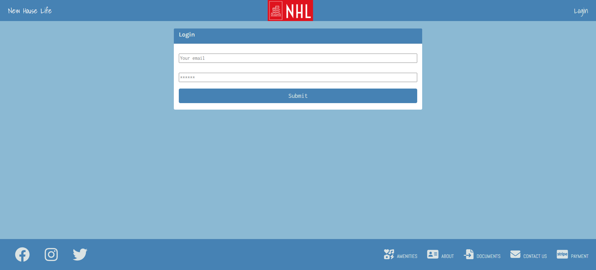

# housing-management-app

https://ancient-journey-45474.herokuapp.com/

## Description

New Home Life is a website for apartment renters to interact with building management by making maintenace or service requests and (in the future), posting rental payments.

## Contents

### Technology

The following dependencies are used in production:
- react
    - react-spring: for animations upon page laod
    - react-fast-marquee: for a marquee element
    - react-bootstrap
- bootstrap
- Fort Awesome(icons)
- JWT
- Emailjs
- graphQL and Apollo
- MongoDB and Mongoose
- faker (for mocking production data)
- bcrypt

### Models

The database has two related tables, and one subtable.

- Admin,  who has access to all information posted
- Unit, for inidividual residents
    - Request: posted by users to request services

## License

This project is licensed under the MIT license

## Website

## Contact

This app was developed by the following people:
- Christopher Backes | [github](https://github.com/chris-backes/)
- Danny Ramirez | [github](https://github.com/dannyramirezgd/)
- Daniel Kim | [github](https://github.com/danielkim13/)
